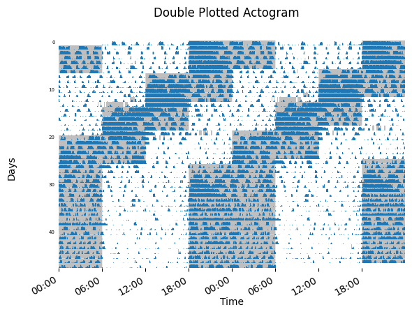

# CircaPy Actogram User Guide

Actograms serve as graphical representations of an organism’s locomotor activity where the x-axis represents time in hours, and the y-axis of an actogram organizes individual days of collected activity data. These plots are typically the initial step of cicadian analysis as they can provide a general understanding of the orgainisms behavior. Visual inspection of an actogram can provide insight to the animal’s periodicity, light/dark (LD) cycles, activity onset/offset, low versus high activity levels, phase shifts, rest periods, and quantity of bouts.


The plots are mapped across a 24-hour cycle but often double plotted where the x-axis represents time across 48-hours to aid in detecting non-24hour rhythms. Within each row of data (days), vertical bars indicate where activity occurred and at what intensity. Background shading provides an indication of light cycles the organism was maintained under. 


### CircaPy Function 
The circaPy `plot_actogram` function allows users to select PIR data and create a double plotted actogram of activity over several days with background shading set by the LDR light phase. This function implements common python packages and libraries such as pandas for data manipulation and analysis, [Matplotlib](https://matplotlib.org/stable/) to create data visualizations, [NumPy](https://numpy.org/doc/stable/index.html) which provides N-dimensional array types and processes various mathematical operations, and [Pingouin](https://pingouin-stats.org/) for running statistical functions.  


In the following example, we plot 18 days of PIR data from 1 mouse kept under a standard 12:12 LD cycle


```Py
    import circaPy.plots as cplt


    plot_actogram(data, subject_no = 0 showfig = True)
```


The `plot_actogram` funciton can also be used to model activity under altered LD conditions. The following figure is an actogram representing PIR activity collected from a mouse maintained under an advanced light phase (jetlag).




For a full description of the function parameters, see our [circaPy documentation](https://circapy.readthedocs.io/en/latest/api/plots.html) website.

Raw scripts and updates for function developments are available on the [circaPy GitHub](https://github.com/A-Fisk/circaPy/tree/main).


### References
1. Siepka, S. M., & Takahashi, J. S. (2005). Methods to record circadian rhythm wheel running activity in mice. Methods in enzymology, 393, 230–239. https://doi.org/10.1016/S0076-6879(05)93008-5
2. Refinetti R. (2004). Daily activity patterns of a nocturnal and a diurnal rodent in a seminatural environment. Physiology & behavior, 82(2-3), 285–294. https://doi.org/10.1016/j.physbeh.2004.03.015
