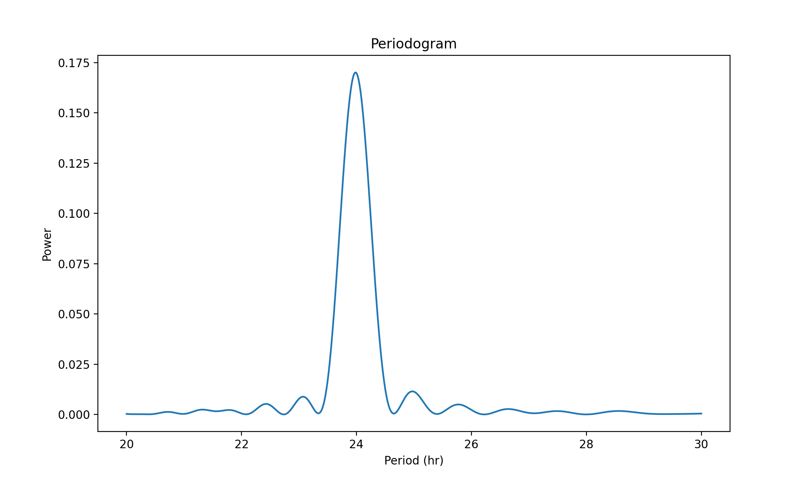

# CircaPy Lomb Scargle Periodogram User Guide
Originally developed by Lomb (cite) and Scargle (cite), teh Lomb-Scargle periodogram analysis processes data with irregularly or fixed time collection intervals to provide a measure of regularity for a given rhythm.

Period estimations are necessary measures to assess the maintenence of circadian rhythms. 

### CircaPy Function

The `lomb_scargle_period` circaPy function allows the user to generate a periodogram analysis for a single selected PIR. The lomb scargle calculations is modeled from _cite_ equation.

As a parameter of this function a low and high period is default 20 hours and 30 hours. However, these limits can be manipulated as a function parameter and adjusted to work with a given set of data from a PIR.

This circaPy function uses standard python packages and libraries such as pandas, numpy, matplotlib. Astropy's timeseries `LombScargle` is implemented to produce power values.

Below is an example line of Python code that has used the circaPy periodoram function. The data set to process and the specific column of PIR data to be analyzed is called.

    print(lomb_scargle_period(data, subject_no = 0))
    
The terminal output for the `lomb_scargle_period` function will provide a dictionary of the Pmax, period, and a data table of the power values for 1 PIR channel.

    {'Pmax': 0.164534545800864, 'Period': 24.025469544671818, 'Power_values':                   
    20.000000  0.000357
    20.000667  0.000355
    20.001334  0.000353
    20.002000  0.000351
    20.002667  0.000349
    ...             ...
    29.994001  0.000487
    29.995500  0.000491
    29.997000  0.000495
    29.998500  0.000499
    30.000000  0.000503

    [10000 rows x 1 columns]}

In the example below, the `showfig` call is added to the function parameters and set to True to generate a plot. The dictionary output is also still provided along with the figure and axis labels.

    print(lomb_scargle_period(data, subject_no = 1, showfig = True))

    
    (<Figure size 2000x1200 with 1 Axes>, <Axes: title={'center': 'Periodogram'}, xlabel='Period (hr)', ylabel='Power'>, {'Pmax': 0.17014071486983728, 'Period': 23.98321007395563, 'Power_values':                   
    20.000000  0.000273
    20.000667  0.000272
    20.001334  0.000270
    20.002000  0.000268
    20.002667  0.000266
    ...             ...
    29.994001  0.000430
    29.995500  0.000432
    29.997000  0.000433
    29.998500  0.000435
    30.000000  0.000436

    [10000 rows x 1 columns]})    

For a full description of the function parameters, see our [circaPy documentation](https://circapy.readthedocs.io/en/latest/api/periodogram.html) website.

Raw scripts and updates for function developments are available on the [circaPy GitHub](https://github.com/A-Fisk/circaPy/tree/main).

### References
1. citation

