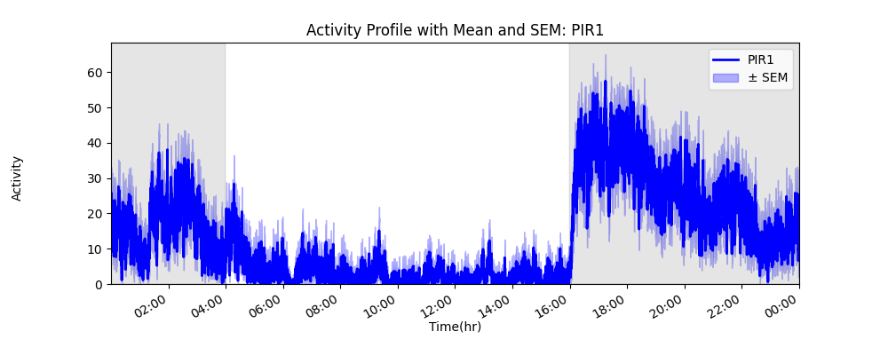
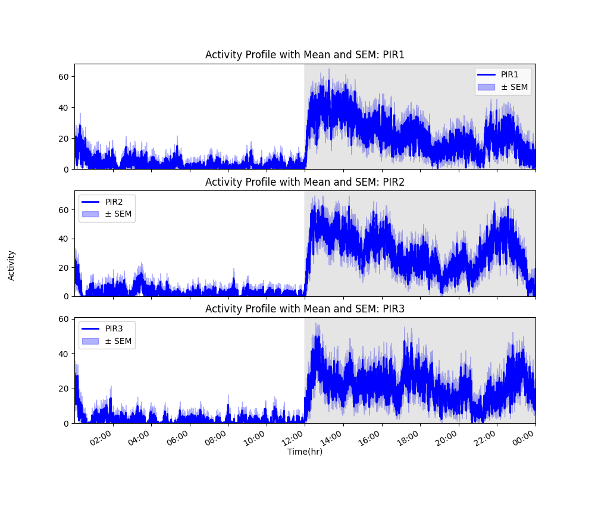

CircaPy Activity Plot User Guide
================================

An activity plot (24-hour plot) is another format for visualizing
locomotor activity. These plots transform the activity data into 1-hour
bins and plots the frequency of activity (y-axis) across a 24-hour day
(x-axis). Background shading is also a key decorator to indicate the
light cycle maintained during data collection.

Similar to the actogram, behavioral activity patterns can be inferred
from a visual inspection of the plot. Activity plots assume a 24-hour
period of the subject being tracked, so longer periods, shorter periods,
or phase shifts are not well represented.

The benefit of an activity plot analysis is the measure of relative
amplitude (RA). This quantification of rhythmic amplitude in the daily
rhythms allows to detection of the maximum and minimum timepoints in
activity. This analysis is provided as a circaPy function, and is
further described in the `Activity User
Guide <https://circapy.readthedocs.io/en/latest/api/activity.html#circaPy.activity.relative_amplitude>`__.

CircaPy Function
~~~~~~~~~~~~~~~~

``plot_activity_profile`` allows the user to select one or multiple
columns of PIR data to visualize over an averaged 24-hour period. The
function output will produce a line graph with a dark blue line to
represent average activity in 1-hour bins as well as a light blue shaded
region to visualize standard error of mean (±SEM).

Similar to circaPy’s ``plot_actogram`` function,
``plot_activity_profile`` includes the use of
`Matplotlib <https://matplotlib.org/stable/>`__,
`pandas <https://pandas.pydata.org/docs/index.html>`__, and
`NumPy <https://numpy.org/doc/stable/index.html>`__ to perform relevant
data processing and generate figures.

In the following example, we plot an activiy plot averaged over 18 days
of PIR activity data for one mouse.

.. code:: py

       import circaPy.plots as cplt

       
       plot_activity_profile(data, col = [0], showfig = True)

   alt text

This figure provides a visual of activity levels against shaded regions
representing the LD cycle.

The ``activity_plot`` function. is capable of adjusting measures such as
timestamp shift, producing multiple plots, and resampling data to a
desired frequency (seconds, minutes, hours).

In this next example we demonstrate an activity plot where the timestamp
has been shifted so ZT0 represents lights on and multiple plots are
generated to compare the activity of multiple mice.

.. code:: py

       import circaPy.plots as cplt

       
       plot_activity_profile(data, col = [0, 1, 2],lights_on = 4, showfig = True)

   alt text

For a full description of the function parameters, see our `circaPy
documentation <https://circapy.readthedocs.io/en/latest/api/plots.html>`__
website.

Raw scripts and updates for function developments are available on the
`circaPy GitHub <https://github.com/A-Fisk/circaPy/tree/main>`__.

References
~~~~~~~~~~

1. citation
2. citation
